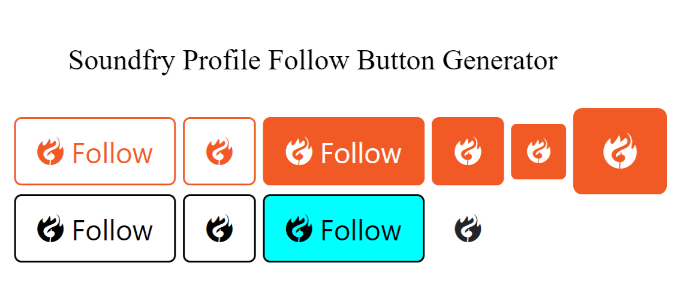

# Soundfry Profile Follow Button Generator
You can generate your **Soundfry** profile **follow button** with the help of this code.

## Preview
Preview Link: https://soundfry-developer.github.io/follow-button-generator
### This is a default button code
```html
<a href="https://soundfry.com/soundfry"><div class="sfb sfb-outline-primary"><i class="soundfry"></i> Follow</div></a><script async src="https://dl.dropboxusercontent.com/s/a64gkohkd5nmcmu/app.js" charset="utf-8"></script>
```
### This is another code for your Soundfry profile
```html
<a href="https://soundfry.com/suraj"><div class="sfb sfb-primary"><i class="soundfry"></i> Follow</div></a><script async src="https://dl.dropboxusercontent.com/s/a64gkohkd5nmcmu/app.js" charset="utf-8"></script>
```
### You can use this code to fully customize the color and size of your buttons
```html
<a href="https://soundfry.com/suraj"><div class="sfb" style="color:black;background-color:white;border-color:black"><i class="soundfry"></i> Follow</div></a><script async src="https://dl.dropboxusercontent.com/s/a64gkohkd5nmcmu/app.js" charset="utf-8"></script>
```
### If you want to use only an icon, you can use this code
```html
<a href="https://soundfry.com/suraj"><div class="sfb"><i class="soundfry"></i></div></a><script async src="https://dl.dropboxusercontent.com/s/a64gkohkd5nmcmu/app.js" charset="utf-8"></script>
```
Thank You
Soundfry Team
